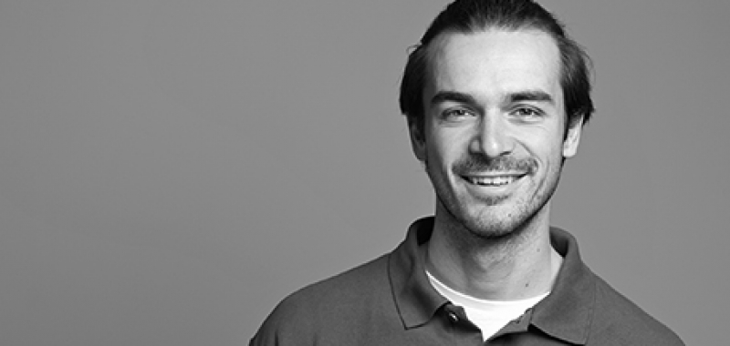

{width="10cm" height="4.7cm"}

Since 2018 Part-time [Physio van den Nobelen](https://www.physio-thun.ch/team) GmbH, Thun

2016 - 2018 [Physiotherapy Koch](https://www.physio-koch.ch/de/), Derendingen

### Education

-   2011 - 2016 Bachelor of Science in Physiotherapy [THIM](https://www.physioschule.ch/)

-   2014 - 2016 Master of Science in Musculoskeletal Sports Physiotherapy (COP) [THIM](https://www.physioschule.ch/)

-   2017 Musculoskeletal Ultrasound

-   2018 EPTE sonographically guided percutaneous electrolysis

-   2019 CFT Cognitive Functional Therapy by Peter O\`Sullivan, London

-   2019 Master of Science in Professional Development (ongoing) [BFH](https://www.bfh.ch/de/?gclid=Cj0KCQjwpImTBhCmARIsAKr58cybpq00vXZkhZyF9EqPro4o-_3iUlmKKxfFiyBhfUfhiLlwz4_LVLEaAniQEALw_wcB)

### Interests

-   Physical therapy

-   Biostatistics & Epidemiology

-   Observational data analysis

-   Survey data analysis

-   Meta-analyses

\
